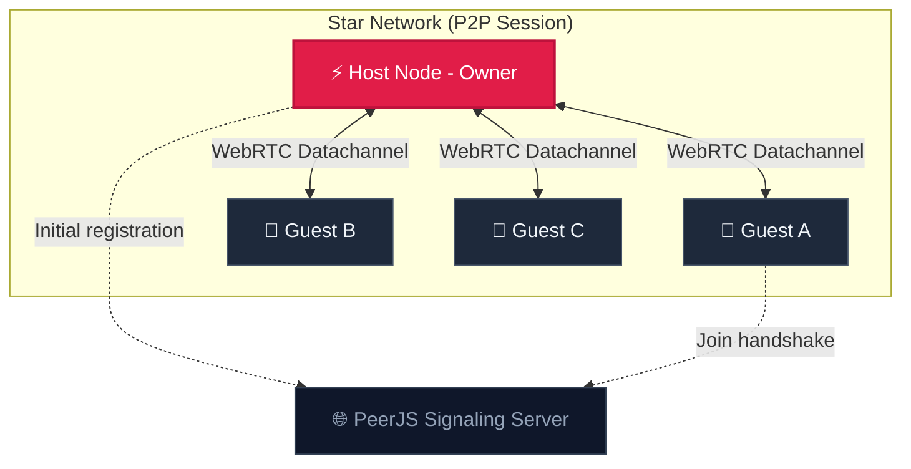

<div align="center">

  
  <br />
  <br />

  <h1>⚡ SyncPad</h1>
  
  <p>
    <strong>The ultimate serverless pastebin. SyncPad lets you edit, sync, and share code snippets or notes in real-time with anyone, anywhere.</strong>
  </p>

  <p>
    
    
    <a href="https://github.com/shubhambelbase/SyncPad/stargazers">
      
    </a>
  </p>

  <h3>
    <a href="https://syncnotepad.netlify.app/">🔴 View Live Demo</a>
  </h3>
</div>

---

## ⚡ The Vibe

This isn't just a notepad; it's a **shared brain with a voice**. Vibe-coded to feel sleek, futuristic, and premium, SyncPad 12 reinvents the pastebin experience.

Built entirely in the flow state, SyncPad pushes the limits of client-side technology—handling multi-user keystroke synchronization, live syntax highlighting, **integrated secure messaging**, and **moderator controls** without a single database or backend server. It's just you, your team, and your notes.

---

## 💡 What It Does

**SyncPad** establishes a secure, direct Peer-to-Peer connection between the host and multiple guest collaborators.

* **The Problem:** Traditional pastebins are static (read-only), chat apps ruin code formatting, and sending files back and forth is slow and insecure.
* **The Solution:** A browser-based, instant collaboration tool. Open the link, paste your code, and **chat securely** while you edit together in a self-healing P2P room. **Privacy by design.**

---

## ✨ Key Features

| 🛡️ **Security & Room Moderation** | 📝 **Ultimate Paste Control** |
| :--- | :--- |
| **👥 Unlimited Guests:** Support for multiple concurrent collaborators. | **Syntax Highlighting:** Auto-detects and colors code using PrismJS. |
| **👀 Active Peer List:** Live eye-icon popup to view active collaborators. | **Smart Tab:** Indent code blocks perfectly inside the text editor. |
| **🚫 Moderator Kick:** Host can kick guests instantly from the session. | **Auto-Scroll Sync:** Viewports stay aligned automatically on edits. |
| **🔒 Host Approval & Locks:** You decide who connects, and can lock edits. | **💾 Zero-Trace Cache:** Caches to `sessionStorage` (erased on tab close). |
| **🛠️ Self-Healing Session:** Recovers connections automatically on reloads. | **🚨 Leave Warnings:** Prevents data loss from accidental tab closes. |
| **E2E Encryption:** Data & Chat flows directly via WebRTC data channels. | **🎨 Premium Red Theme:** Clean Light and deep Dark high-contrast styling. |
| **📁 File Sharing:** Drag-and-drop or select files P2P (max 20MB). | |

---

## 📐 Architecture & Topology

SyncPad operates on a **P2P Hub-and-Spoke (Star) Topology**:
* **The Host acts as the central hub**, maintaining a queue of incoming client connections.
* **Guests connect directly to the Host** using WebRTC datachannels via PeerJS.
* When a guest makes a change, they send the synchronization payload to the Host, who updates their local view and **broadcasts the delta** out to all other connected guests.
* All communications are encrypted, direct, and zero-knowledge.



> [!IMPORTANT]
> **Data Privacy Audit**: SyncPad has **zero database tracking or logs**. Since all data travels strictly peer-to-peer via WebRTC and is cached in transient `sessionStorage` (which is wiped automatically the second you close the tab), your documents are completely private and untraceable.

---

## 🛠️ Built With

* **WebRTC (PeerJS):** For low-latency, encrypted P2P text, chat, and room list synchronization.
* **PrismJS:** For beautiful, lightweight syntax highlighting.
* **Vanilla CSS (Variables & Tokens):** Responsive design, glassmorphism, and a high-contrast premium red palette.
* **Vanilla JS:** Zero framework bloat for maximum performance and security on any device.

---

## 🚀 How to Run

Because this app uses WebRTC, **it works best via HTTPS** or `localhost`.

### Option 1: GitHub Pages / Netlify (Easiest)
1. Fork this repo.
2. Deploy to **GitHub Pages** or **Netlify**.
3. Open the link on multiple devices (one as **Host**, others as **Guests**).

### Option 2: Local Network
1. **Clone the repo:**
   ```bash
   git clone https://github.com/shubhambelbase/SyncPad.git
   ```
2. **Navigate to folder:**
   ```bash
   cd SyncPad
   ```
3. **Run with a live server:**
   (VS Code "Live Server" extension is recommended)
   ```bash
   # Or using Python 3
   python -m http.server 8000
   ```

---

## 📖 How to Use

1. **Host Mode (Owner):**
   * Open the app and click **"Start Session"**.
   * Copy the **4-digit Room Code** or click the **magic link** button to copy the join URL.
   * Approve or deny incoming requests from collaborators as they join.
   * Click the **eye icon** in the toolbar to see active peers or **Kick** them.
   * (Optional) Use the **Lock** icon to freeze editing for all guests.

2. **Join Mode (Guest):**
   * Enter the 4-digit code in the "Join" box (or open the shared Magic Link).
   * Wait for the Host to **Approve** your connection.
   * Once approved, your document and chat sync instantly.
   * **Use the Chat Sidebar** to discuss code in real-time!

---

## 🤝 Contributing

Got an idea to make this even more "Vibe Coded"?
1. Fork it.
2. Create your Feature Branch (`git checkout -b feature/FileSharing`)
3. Commit your Changes.
4. Push to the Branch.
5. Open a Pull Request.

---

<div align="center">
  <p>Vibe coded with ❤️ by <a href="https://github.com/shubhambelbase">Shubham Belbase</a></p>
</div>
